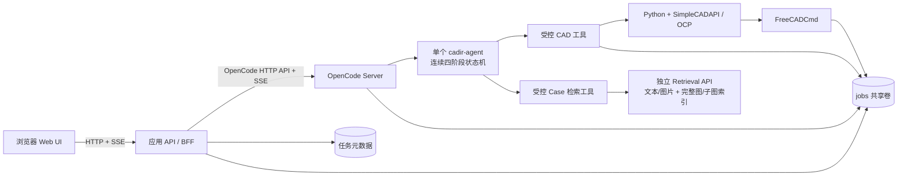
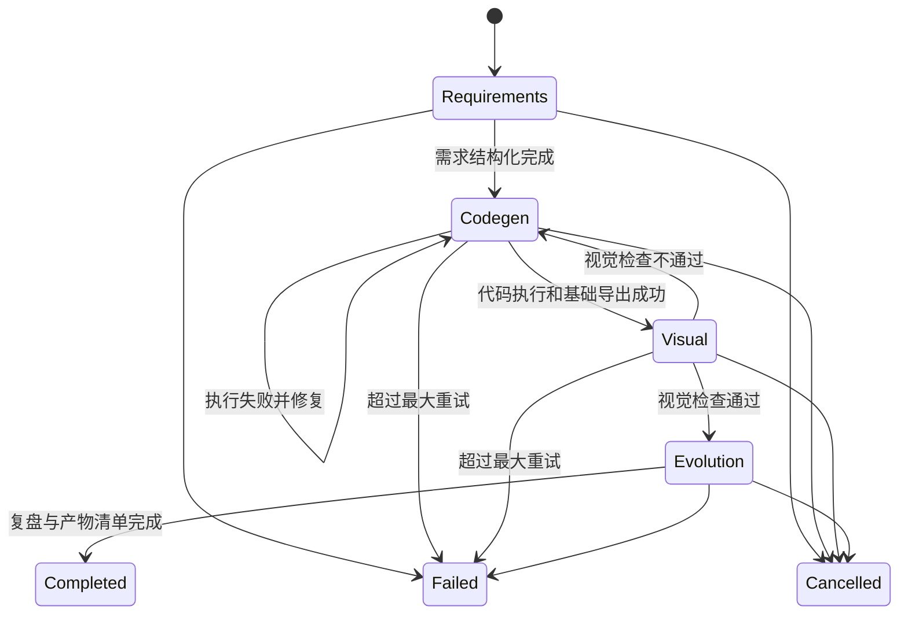
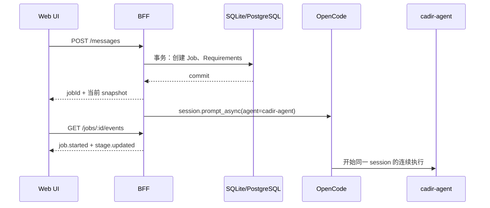
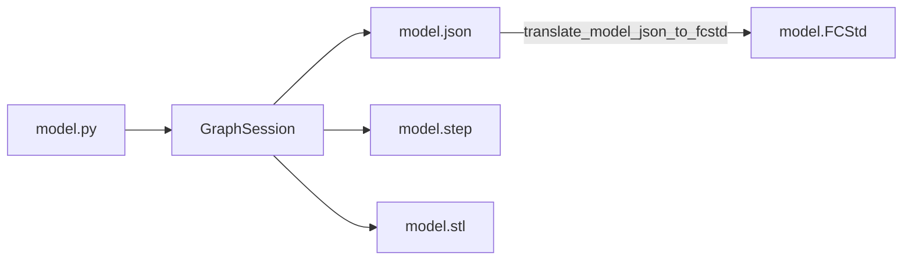

# CADIR OpenCode Web Agent - 任务与实施规格（讨论稿）

> 文档状态：v0.2，已加入独立的构造图 Case 检索服务设计。
>
> 依据：工作区论文 `CADIR_AAAI2026 (7).pdf`、`SimpleCADAPI-master.zip`，以及 OpenCode 当前官方 Server、SDK、Agent、Custom Tools 文档。

## 1. 项目目标

构建一个面向 CAD 生成的 Web 对话应用：用户输入自然语言，并可附带参考图片；系统以单个 OpenCode agent 作为核心，在同一会话中持续执行 CADIR 论文对应的四个阶段：需求分析、CADIR Python 代码生成、执行与视觉反馈、自进化复盘，最终生成并展示可下载的 CAD 产物。

前端必须实时展示：

- OpenCode 流式输出的文字；
- 当前阶段及每个阶段的状态；
- 本轮输入 token、输出 token 和累计 token；
- 用户上传且被 agent 阅读的图片；
- agent 或 CAD 渲染器产生的图片；
- 最终 `.step`、`.py`、`.stl`、`.FCStd` 文件的位置与下载入口。

部署使用 Docker Compose。执行 CAD 的容器必须安装 Python、SimpleCADAPI/CADIR、OpenCode 和无界面的 FreeCAD 命令行环境，以便将 CADIR construction graph/model JSON 转换为可编辑的 FreeCAD `.FCStd` 文件。

## 2. 本期范围

### 2.1 必须完成

1. 单用户可用的 Web 对话页面。
2. 文本输入和图片附件输入。
3. OpenCode 会话创建、连续对话、取消生成和失败重试。
4. 基于 SSE 的端到端流式消息。
5. 四阶段状态机：需求分析、代码生成、视觉反馈、自进化。
6. CADIR Python 文件生成及受控执行。
7. STEP、STL、construction graph/model JSON、预览图生成。
8. 使用 FreeCADCmd 生成 `.FCStd`。
9. Token 用量的单轮和会话累计展示。
10. 产物清单、文件下载、图片预览。
11. Docker Compose 一键启动前端、API 网关和 OpenCode/CAD 执行环境。
12. 全流程只使用一个 primary agent，不创建或调用任何 subagent。
13. 支持文本/图片到相似 CAD Case 的完整图检索，以及完整图与三维特征子图联合检索。

### 2.2 明确不做

- 不在 CADIR API 或浏览器内加载 embedding 模型；embedding、索引和召回统一由独立 Retrieval API 管理。
- 不把原始 embedding 暴露给浏览器或 OpenCode agent。
- 暂不引入外部向量数据库；基础索引和动态索引由 Retrieval API 以版本化文件管理。
- 暂不支持 SolidWorks 和 Fusion 360 转换。
- 暂不做多人协作、组织权限、计费和云对象存储。
- “自进化”不表示在线训练模型，也不自动修改生产 agent 的系统提示词。

### 2.3 自进化在本期的定义

自进化负责对当前任务轨迹做复盘并输出结构化经验，包括：成功做法、失败操作、修复过程、最终验证结果和可复用建议。成功归档的最新 revision 会异步提交给 Retrieval API 建立完整图和三维特征子图索引。

建议输出：

```text
jobs/<job_id>/artifacts/experience.json
jobs/<job_id>/artifacts/experience.md
```

检索仅使用视觉验收成功并完成自进化归档的 Case；索引失败不改变已经完成的 CAD Job 状态。

## 3. 论文能力到单 Agent 系统的映射

论文使用主 agent 与多个功能 agent。为降低首版实现复杂度，本系统不复刻多 agent 调度，而是将这些职责改为单个 `cadir-agent` 内部的连续阶段。同一个 OpenCode session 持有完整上下文、执行修复循环并输出最终结果。

| 论文职责 | 本系统实现 | 前端状态 | 核心输出 |
| --- | --- | --- | --- |
| 任务控制 | `cadir-agent` 内部状态机 | 整体运行状态 | 阶段推进、重试、最终总结 |
| Requirement Analysis | `cadir-agent` 第 1 阶段 | 需求分析 | `requirements.md`、建模步骤 |
| Code Generation | `cadir-agent` 第 2 阶段 | 代码生成 | `model.py`、`model.json`、STEP、STL |
| Visual Feedback | `cadir-agent` 第 3 阶段 | 视觉反馈 | 多视图图片、检查结论、修改建议 |
| Self-evolution | `cadir-agent` 第 4 阶段 | 自进化 | `experience.json`、`experience.md` |

Retrieval Module 由独立常驻服务实现，并作为同一个 `cadir-agent` 的受控工具能力；它不是 OpenCode 子智能体。

## 4. 总体架构



### 4.1 为什么需要一个薄 API/BFF

OpenCode 仍然是 agent 后端核心，但浏览器不应直接连接 OpenCode Server，原因如下：

- OpenCode 的服务密码和模型凭据不能暴露给浏览器；
- OpenCode `/event` 是实例事件总线，应用层需要按 `session_id/job_id` 过滤；
- 阶段状态、产物、图片、Token 需要统一成稳定的前端事件协议；
- 上传、下载、路径校验、任务取消和断线重连属于应用后端职责；
- 前端不应获得任意文件读取或命令执行能力。

BFF 不实现模型推理，只负责身份校验、任务管理、OpenCode Server 调用、事件归一化和产物服务。

## 5. 建议技术栈

### 5.1 前端

- React + TypeScript + Vite。
- 状态管理：首版使用 React state 与专用 `JobStreamController`；后续复杂度上升时再引入 Zustand。
- 数据请求：原生 `fetch`；SSE 使用 `EventSource`，若发送鉴权头则使用 fetch-stream polyfill。
- Markdown 渲染：首版将流式文本按纯文本安全展示；启用 `react-markdown` 时必须禁用原始 HTML。
- 图标：Lucide React。
- 测试：Vitest + React Testing Library + Playwright。

### 5.2 应用 API/BFF

- Node.js + TypeScript。
- HTTP 框架：Fastify。
- OpenCode 接入：首版使用封装在 `OpenCodeAdapter` 内的官方 HTTP/OpenAPI 端点；接口稳定后可无缝替换为 `@opencode-ai/sdk`。
- 校验：Fastify 路由校验与领域 guard；后续可统一为 Zod schema。
- 元数据：首版使用原子替换写入的 JSON store；生产扩展阶段迁移 SQLite/PostgreSQL，任务文件继续使用共享卷。
- 测试：Node test runner + Fastify inject。

选择 TypeScript BFF 的原因是 OpenCode 同时提供 OpenAPI HTTP 接口和类型安全 SDK。当前适配器只封装创建 session、异步 prompt、abort、状态/消息查询与全局事件订阅，浏览器协议不依赖具体 OpenCode 客户端实现。

### 5.3 CAD 执行环境

- Python 3.11（最终以 SimpleCADAPI 实际支持版本为准）。
- `simplecadapi==2.0.1b1` 或从工作区源码锁定安装。
- OCP/OCCT 依赖。
- FreeCADCmd，无 GUI 运行。
- 可选底层显示依赖：Mesa、Xvfb；仅用于让 SimpleCADAPI `render_screenshot_rpath(...)` 在 headless Docker 中正常运行，不作为替代渲染器。

## 6. OpenCode 配置

### 6.1 Agent 文件

建议放在项目内：

```text
.opencode/
  agents/
    cadir-agent.md
  skills/
    simplecadapi/
      SKILL.md
      references/...
  tools/
    cadir-stage.ts
    cadir-run.ts
    cadir-publish.ts
    cadir-image.ts
    cadir-retrieve.ts
    cadir-case-read.ts
opencode.json
AGENTS.md
```

`cadir-agent` 配置为 `mode: primary`。其系统提示词定义固定的四阶段执行顺序、重试规则、产物要求和完成条件。`permission.task` 设为 `deny`，确保不能创建或调用 subagent；阶段切换只是同一 agent 内的状态变化。

单 agent 的关键约束：

- 一次 job 从开始到结束只绑定一个 OpenCode session。
- 所有阶段共享同一消息历史和工具执行上下文。
- agent 必须完成或明确失败当前阶段后才能进入下一阶段。
- 视觉反馈不通过时，同一 agent 将状态切回代码生成并继续修改。
- 不使用 `@agent`、Task 工具、child session 或后台 subagent。

### 6.2 权限原则

- 允许读取项目说明、SimpleCADAPI 文档和当前 job 输入。
- 只允许写入当前 `jobs/<job_id>/work` 与 `artifacts`。
- 不允许访问宿主机其他路径。
- 禁止 Task 工具和全部 subagent 调用。
- Bash 默认拒绝；只开放经过包装的 CAD 执行工具。
- 禁止网络搜索和任意外部下载；Case 检索只能经 BFF 的内部接口访问 Retrieval API。
- FreeCAD 转换必须经 `cadir-run` 工具，不允许模型拼接任意 shell 命令。
- 所有输入路径先 `resolve`，并校验仍位于当前 job 根目录内。

### 6.3 自定义工具

为保证前端状态可靠，不能通过猜测模型文本判断阶段。OpenCode 自定义工具放在 `.opencode/tools/`，由 agent 显式调用：

#### `cadir_stage`

agent 只能申请阶段动作，不能直接指定 job、尝试次数或最终数据库状态。工具从 OpenCode tool context 取得 `sessionID`，BFF 再通过 session-job 绑定找到当前任务。

参数：

```json
{
  "stage": "requirements | codegen | visual | evolution",
  "action": "complete | retry | fail | needs_input",
  "summary": "简短且可展示的状态说明",
  "error": {
    "code": "可选的机器错误码",
    "message": "可选的用户可读错误"
  }
}
```

工具调用 BFF 的仅容器内部可访问接口 `POST /internal/stage-transition`，并提交 `sessionID`、`stage`、`action` 和摘要。BFF 校验状态迁移与产物条件后，在事务中更新数据库并生成 `stage.updated` SSE 事件。工具返回服务端确认后的 `jobStatus`、`stageStatus`、`attempt` 和 `seq`；若迁移非法则返回结构化错误，agent 必须纠正流程，不能绕过。

#### `cadir_run`

仅接受固定动作，不接受任意命令字符串：

```text
validate_python
run_model
export_model_json
export_step
export_stl
render_views
convert_fcstd
inspect_artifacts
```

工具设置超时、记录退出码、截断超长日志，并返回结构化错误。

#### `cadir_python_probe`

用于在正式 `cadir_run` 前验证不确定的 SimpleCADAPI 或 QL 运行时行为。工具只接受一段短 Python 代码，不接受 shell 命令；代码只能导入 `simplecadapi` 和 `math`，不能读写文件、启动进程、访问网络、读取 dunder 属性或调用 STEP/STL/PNG/FCStd 导出函数。

probe 在一次性临时目录中执行，不登记 Artifact、不更新阶段状态，也不能替代正式模型运行。默认限制为 10 秒、12 KiB 代码和 12 KiB stdout/stderr；CPU、地址空间、文件大小与文件描述符均受限。正常结果和 Python traceback 都以结构化 JSON 返回，临时目录在调用结束后删除。

#### `cadir_publish`

登记一个最终或中间产物，计算文件大小和 SHA-256，生成受控下载 URL。只允许已批准扩展名：

```text
.py .json .step .stp .stl .FCStd .png .jpg .jpeg .webp .md .log
```

#### `cadir_image`

用于读取或登记图片。每次成功读取输入图片时产生 `image.read` 事件；每次生成预览图时产生 `artifact.created` 事件。这样前端可以准确区分“已上传”和“agent 已读取”。

### 6.4 模型服务配置

本期模型与服务端已经确定：

```text
provider id: cadir
model id: gpt-5.6-sol
default model: cadir/gpt-5.6-sol
base URL: https://openrouter.icu/v1
```

OpenCode 使用官方 OpenAI-compatible custom provider 配置，密钥只从服务端环境变量读取：

```json
{
  "$schema": "https://opencode.ai/config.json",
  "model": "cadir/gpt-5.6-sol",
  "provider": {
    "cadir": {
      "npm": "@ai-sdk/openai-compatible",
      "name": "CADIR GPT",
      "options": {
        "baseURL": "{env:CADIR_LLM_BASE_URL}",
        "apiKey": "{env:CADIR_LLM_API_KEY}"
      },
      "models": {
        "gpt-5.6-sol": {
          "name": "GPT-5.6 Sol",
          "modalities": {
            "input": ["text", "image"],
            "output": ["text"]
          }
        }
      }
    }
  }
}
```

`.env.example` 只包含变量名和非敏感 base URL，不包含真实 API Key。前端不得接收 `CADIR_LLM_API_KEY`；BFF 日志不得打印 Authorization header。

## 7. 四阶段状态机



每个阶段状态：`pending | running | succeeded | failed | retrying | waiting_input | skipped | cancelled`。

任务总状态：`queued | running | waiting_input | completed | failed | cancelled`。

约束：

- 同一时刻只能有一个阶段为 `running`。
- 状态只能按允许的边迁移，服务端拒绝非法倒退。
- 视觉反馈回到代码生成时，两个阶段的 `attempt` 均保留历史。
- 所有事件带单调递增 `seq`，断线后通过 `Last-Event-ID` 补发。
- 任何失败都必须包含机器可读 `error.code` 和用户可读 `error.message`。

### 7.1 状态由谁更新

状态的唯一事实源是 BFF 数据库，不是 agent 文本、前端本地状态或 `events.jsonl`。

| 触发者 | 触发动作 | BFF 更新 |
| --- | --- | --- |
| 用户提交消息 | 创建 job | `job: queued -> running`，`requirements#1: pending -> running` |
| 单个 agent | 调用 `cadir_stage(complete)` | 校验 guard 后结束当前阶段，并由 BFF 自动启动下一阶段 |
| 单个 agent | 调用 `cadir_stage(retry)` | 关闭当前 attempt，创建下一 attempt |
| 单个 agent | 调用 `cadir_stage(fail)` | 当前阶段和 job 置为 `failed` |
| 单个 agent | 调用 `cadir_stage(needs_input)` | 当前阶段和 job 置为 `waiting_input` |
| CAD 工具 | 返回执行结果 | 只记录 tool/artifact 事件，不自动宣告阶段成功 |
| 用户点击停止 | 调用取消 API | BFF 强制当前阶段和 job 置为 `cancelled` |
| BFF watchdog | 检测进程退出或超时 | 置为 `failed`，错误码为 `JOB_TIMEOUT` 或 `OPENCODE_UNAVAILABLE` |

前端无权更新正式状态。前端按钮只能发出命令，界面必须等待服务端返回的 snapshot 或 SSE 事件后再改变状态。

### 7.2 Session 与 Job 绑定

创建 job 时，BFF 完成以下绑定：

```text
conversation_id -> opencode_session_id
job_id          -> opencode_session_id
opencode_session_id -> active_job_id
```

同一 conversation 可以长期复用一个 OpenCode session，但同一时刻只能绑定一个 active job。`cadir_stage` 从 tool context 读取 `sessionID`，不接受模型传入的 `jobId`，防止模型误更新另一个任务。

### 7.3 启动更新流程

用户发送消息时，BFF 必须先落库，再调用 OpenCode：



初始数据库结果：

```json
{
  "job": { "status": "running", "currentStage": "requirements" },
  "stages": [
    { "stage": "requirements", "attempt": 1, "status": "running" }
  ]
}
```

因此第一个状态不依赖模型主动上报；即使 OpenCode 启动失败，用户也能看到任务已经进入需求分析，随后收到明确失败事件。

### 7.4 正常阶段迁移

同一个 agent 在完成阶段工作后调用 `cadir_stage({ stage, action: "complete" })`。BFF 不直接相信调用，而是检查 guard：

| 迁移 | 必须满足的 guard | 更新结果 |
| --- | --- | --- |
| requirements -> codegen | `requirements.md` 存在，UTF-8 可读，且八个固定章节均有非空正文 | requirements 成功，创建 `codegen#1 running` |
| codegen -> visual | 本次 codegen StageRun 下的受控 Python 执行退出码为 0；新的 `model.py` 与 canonical `model.json` 已登记并通过重放校验 | codegen 成功，创建新的 `visual running` |
| visual -> codegen(repair) | 四视图中存在不符合需求的几何或外观，且仍有修复次数 | visual attempt 失败，创建新的 `codegen running`；不得进入 evolution |
| visual -> evolution(finalize) | 四张预览均由 `render_screenshot_rpath(...)` 产生、非空且已被 agent 阅读，视觉检查通过 | visual 成功，创建最终复盘用 `evolution running` |
| evolution(finalize) -> completed | 最终 manifest、STEP、STL、FCStd、`model.py`、`requirements.md` 与 model JSON 全部存在并已验证 | evolution 成功，job 完成 |

一次 `complete` 请求在同一数据库事务内执行：

```text
1. SELECT 当前 Job 和 StageRun（加写锁或乐观版本检查）
2. 校验 session 绑定、当前 stage、attempt 和迁移 guard
3. UPDATE 当前 StageRun
4. INSERT 下一 StageRun，或 UPDATE Job=completed
5. 为每个变化 INSERT Event，并分配 job 内递增 seq
6. COMMIT
7. commit 成功后发布 SSE
```

数据库更新与 Event 插入必须原子完成。不能先推送 SSE 再落库，否则进程崩溃后前端会显示数据库中不存在的状态。

下一阶段的 `running` 状态由这次 `complete` 迁移自动产生；agent 不再单独发送 `start`，从而避免上一阶段已经成功但下一阶段尚未启动的中间空档。

服务端伪代码：

```ts
async function transitionBySession(sessionId: string, request: StageAction) {
  return db.transaction(async (tx) => {
    const job = await tx.lockActiveJobBySession(sessionId)
    assertAllowed(job, request)
    await assertGuardSatisfied(job, request)

    const changes = applyTransition(job, request)
    await tx.save(changes)
    const events = await tx.appendEvents(job.id, changes)
    return { snapshot: changes.snapshot, events }
  }).then(async (result) => {
    await eventBus.publish(result.events)
    return result.snapshot
  })
}
```

### 7.5 重试与视觉回路

`retry` 不覆盖旧记录，而是创建新的 `StageRun`：

```text
codegen#1 running -> failed
codegen#2 retrying -> running
```

视觉反馈不通过时，仍由同一个 agent 返回新的代码生成轮次，修改同一个 `model.py`，重新执行并再次进行视觉检查：

```text
visual#1 running -> failed
codegen#3 running (修订同一个 model.py，并重新执行)
codegen#3 completed -> visual#2 running
```

只有视觉通过后才允许创建 `evolution`。该阶段是最终复盘 attempt，不再负责修代码。agent 在其中调用 `cadir_publish` 登记不可变 manifest，然后申请 `evolution complete`。只有 BFF 验证完整产物集后才把 Job 更新为 `completed`；`cadir_publish` 工具本身不能绕过状态机提前完成 Job。

前端按“代码生成轮次”而不是底层 attempt 渲染：相邻的 `codegen#1/#2/#3` retry 合并为一个“代码生成”区块，错误、修复过程、耗时和 token 在区块内累计；一旦经过 visual，后续 codegen 属于新轮次并创建新的“代码生成”区块。BFF 仍保留每个 StageRun 的独立审计记录。

BFF 自动增加 attempt，agent 不传 attempt。旧 attempt 的开始时间、结束时间、错误、token 和日志引用均保留。达到 `CAD_MAX_REPAIR_ATTEMPTS` 后，BFF 拒绝新的 retry，并将 job 置为 `failed`。

### 7.6 等待用户补充

需求分析发现关键尺寸缺失时，agent 调用 `needs_input`：

```text
requirements#1 running -> waiting_input
job running -> waiting_input
```

BFF 先保存 `job.needs_input` 事件，再允许 OpenCode 本轮结束。用户补充信息后，`POST /messages` 带 `resumeJobId`；BFF 校验该 job 确实处于 `waiting_input`，创建 `requirements#2 running`，并在同一个 OpenCode session 中继续。

### 7.7 失败、取消和异常退出

- `fail`：agent 判断当前阶段无法继续时主动调用；BFF 保存错误并结束 job。
- 工具失败：`cadir_run` 只上报工具失败，agent 可决定修复并 retry；工具不能自己把 job 标记成功。
- 用户取消：BFF 先原子写入 `cancelled` 状态和事件，再调用 OpenCode abort 并终止子进程。终止失败只记内部告警，不撤销 cancelled。
- OpenCode 异常退出：BFF 到 OpenCode 的事件订阅结束后立即查询健康状态和 session 状态；确认进程不可用时，由 watchdog 将活动 job 标记为 failed。
- BFF 重启：启动时扫描 `running` job，与 OpenCode session、消息历史、工具结果和 artifact manifest 对账；恢复订阅后再决定继续、完成或标记 `failed/interrupted`，不凭本地旧状态猜测。
- 重复请求：所有内部迁移带 `transitionId`；相同 ID 重放时返回原结果，不再次增加 attempt 或 seq。

终态 `completed | failed | cancelled` 不允许再次迁移。用户点击“重试整个任务”时创建新 job，并用 `parent_job_id` 指向原 job。

### 7.8 两级事件连接

系统有两条彼此独立的长连接：

```text
OpenCode Server --SSE--> BFF --SSE--> Browser
```

- BFF 到 OpenCode：后台常驻订阅。即使没有任何浏览器在线，也必须继续接收 OpenCode 事件、更新数据库和 artifact manifest。
- Browser 到 BFF：只负责界面实时展示。浏览器关闭、刷新、休眠或断网绝不能取消 OpenCode session，也不能停止 BFF 的后台订阅。

不得把浏览器的 SSE 生命周期绑定到 OpenCode prompt 或 worker 生命周期。最后一个浏览器断开时，后端任务仍继续运行；用户稍后重新打开 Session 时，从持久化状态恢复。

### 7.9 SSE 如何驱动前端状态

`stage.updated` 事件携带完整的当前阶段摘要，而不是只携带模糊文本：

```json
{
  "seq": 18,
  "type": "stage.updated",
  "data": {
    "jobStatus": "running",
    "currentStage": "visual",
    "stage": "visual",
    "attempt": 1,
    "previousStatus": "pending",
    "status": "running",
    "summary": "正在生成并检查四个视图",
    "startedAt": "2026-07-20T12:01:10Z",
    "finishedAt": null
  }
}
```

前端更新规则：

1. 首次打开或重新打开 Session，先请求 `GET /api/jobs/:jobId` 获得完整 authoritative snapshot。
2. 用 snapshot 的 `lastSeq` 连接 `GET /events?after=<lastSeq>`。
3. 只处理 `seq > lastAppliedSeq` 的事件。
4. 若发现 seq 跳号，暂停增量更新并重新拉取 snapshot。
5. reducer 按 `stage + attempt` 更新，不用 assistant 文本推测状态。
6. `message.delta`、`usage.updated`、`artifact.created` 与阶段事件分别更新对应区域，不能改变阶段状态。
7. 收到终态事件后关闭自动重连并重新拉取一次最终 snapshot/manifest。
8. snapshot 的状态永远覆盖前端缓存；如果 snapshot 是 `failed`，必须立即停止所有阶段 loading 并展示后端错误。
9. 恢复连接时还要刷新 Session 列表，不能只刷新当前打开的 Session。

快照与事件连接之间允许发生新事件，因为事件已按 seq 持久化。例如 snapshot 返回 `lastSeq=120`，浏览器随后连接 `after=120`；在这段间隙产生的 121、122 仍会从数据库补发，不会丢失。

### 7.10 前端重连算法

前端不能保证物理网络永不掉线，但必须自动检测、恢复并重新同步，不能永久停留在旧 loading。

连接状态：

```text
connecting | connected | stale | reconnecting | offline | closed
```

推荐流程：

```ts
async function synchronize(jobId: string) {
  setConnectionState("connecting")

  const snapshot = await api.getJob(jobId)
  replaceLocalState(snapshot)

  if (isTerminal(snapshot.job.status)) {
    stopAllLocalLoading()
    setConnectionState("closed")
    return
  }

  connectEventStream(jobId, snapshot.lastSeq)
}
```

断线后的处理顺序：

1. SSE `error`、读取异常或 45 秒没有收到任何事件/heartbeat 时，将连接标为 `stale`。
2. 立即停止“正在建模”等旋转动画，改为中性提示“连接中断，正在同步服务器状态”。此时不得把 job 改成 failed，也不得继续假装后端正在运行。
3. 关闭旧 SSE，先重新请求 job snapshot，而不是直接延续本地状态。
4. 如果 snapshot 为 `completed | failed | cancelled`，立即应用终态、停止重连和 loading。
5. 如果 snapshot 仍为 `running | waiting_input`，用新的 `lastSeq` 建立 SSE。
6. 请求失败时按指数退避重试：`0.5s, 1s, 2s, 4s, 8s, 15s`，之后保持最多每 15 秒一次，并增加 0-30% jitter。
7. 监听 `online`、页面重新获得焦点和 `visibilitychange -> visible`，触发一次立即 synchronize，不等待下一次退避。
8. `offline` 时停止高频请求，显示“网络已断开”；收到 `online` 后立即恢复。
9. 只要 job 不是终态，就不设置固定的最大重连次数。

每个 job 的连接控制器使用 `AbortController`。切换 Session 时终止旧 Session 的浏览器 SSE，但不能调用 job cancel；切回时重新执行 snapshot-first 同步。

### 7.11 后端持续同步与 watchdog

BFF 必须有独立于 HTTP 请求的 `OpenCodeEventSupervisor`：

- 应用启动后建立 OpenCode `event.subscribe()` 常驻连接。
- 每个 OpenCode event 先持久化，再广播给当前浏览器订阅者。
- 没有浏览器订阅者时仍然消费和持久化事件。
- OpenCode SSE 断开时自行重连，并通过 OpenCode session/message API 补查状态。
- 定期更新每个活动 job 的 `backendHeartbeatAt` 和 `lastOpenCodeEventAt`。
- 工具进程退出、OpenCode assistant message 返回 error 或 OpenCode session 结束时，必须原子更新 job，不能等 agent 再发一条自然语言。
- `running` job 超过配置的 watchdog 时间且 OpenCode session 已不再运行时，写入 `job.failed`，错误码使用 `OPENCODE_SESSION_LOST` 或 `JOB_TIMEOUT`。
- BFF 启动恢复时，对每个非终态 job 执行 reconciliation，再对外报告健康。

后端错误优先级高于前端缓存。例如用户断线期间 Python 执行失败：BFF 应继续记录 `CAD_EXECUTION_FAILED` 和 `job.failed`；用户重新打开网页时，第一个 snapshot 就应显示失败，不得先恢复旧的“正在建模”。

### 7.12 状态与 Token 的关系

每个 OpenCode assistant message 完成时，BFF 将 usage 归属到事件发生时的 `stage_run_id`。因此前端既能显示会话累计 token，也可以展示每个阶段/attempt 的 token。流式过程中若 OpenCode 尚未给出最终 usage，Token 区显示“统计中”，不能按文字长度伪造。

### 7.13 状态与重连验收用例

必须增加以下自动化测试：

- 非法 `requirements -> visual` 被拒绝，数据库和 seq 均不变化。
- 两个相同 `transitionId` 只产生一次迁移。
- codegen 缺少 STEP 时，`complete` 被 guard 拒绝。
- visual 失败后创建 `codegen#2`，且 `codegen#1` 历史仍可查询。
- SSE 推送失败但数据库提交成功时，重连仍能补发事件。
- 数据库事务失败时不得向 SSE 发布状态。
- 取消与 agent complete 同时发生时只允许一个终态生效。
- BFF 重启后能恢复 snapshot 与最后 seq。
- 浏览器关闭期间后端完成任务，重新打开后第一个 snapshot 直接显示 completed 和最终总结。
- 浏览器关闭期间后端失败，重新打开后第一个 snapshot 直接显示 failed，不出现 running loading。
- SSE 断开但 BFF 正常时，任务继续执行且事件继续持久化。
- 断开期间产生 20 条事件，重连后按 seq 完整补发且文字不重复。
- snapshot 与 SSE 建连间产生的新事件不会丢失。
- 45 秒无 heartbeat 时 loading 被暂停并显示连接中断。
- 网络恢复、窗口重新聚焦和标签页重新可见时立即执行 snapshot-first 同步。
- 后端返回终态后前端停止重连，不再显示旋转动画。

## 8. 每阶段任务定义

### 8.1 需求分析

输入：用户文本、尺寸、约束、参考图片及会话历史。

输出 `requirements.md`，禁止生成 `requirements.json`。文件至少包含：

```markdown
# 建模需求

## 对象
零件或装配体名称与用途。

## 单位
mm

## 尺寸
- 关键尺寸及公差。

## 功能与几何约束
- 必须满足的结构关系。

## 假设
- 对非关键缺失信息采用的明确假设。

## 建模步骤
1. 可执行的 CADIR 建模顺序。

## 验收检查
- 几何、视觉和文件导出检查。

## 待确认信息
- 只有会显著改变模型结构的问题才放在这里。
```

BFF 只检查固定 Markdown 标题存在且相应正文非空，不把 Markdown 临时转换成 JSON 作为正式产物。agent 后续直接读取 `requirements.md` 继续建模。

若缺失信息不会显著改变模型，则记录合理假设继续；若会导致完全不同的结构，结束当前运行并返回 `needs_input` 消息，不伪造关键尺寸。

### 8.2 代码生成

生成 `model.py`。必须遵循 SimpleCADAPI 的可重放工作流：

1. 在 `GraphSession` 中建立模型。
2. 使用明确、函数式 CAD 操作。
3. 通过 QL 或少量几何事实逐步验证，不打印完整实体对象。
4. 使用语义 tag 表达设计意图。
5. 布尔合并使用 `union_rsolid(...)`，并验证结果是单一 Solid。
6. 使用 `export_model_json(session)` 生成规范模型 JSON。
7. 使用 `export_step(...)` 和 `export_stl(...)` 导出制造文件。
8. 每次主要操作后输出小而明确的 grounding 信息，如体积、面数、选择数量或中心位置。

标准输出路径：

```text
jobs/<job_id>/work/model.py
jobs/<job_id>/artifacts/model.json
jobs/<job_id>/artifacts/model.step
jobs/<job_id>/artifacts/model.stl
```

### 8.3 视觉反馈

至少生成四张图：等轴测、正视、俯视、侧视。唯一允许的渲染入口是 SimpleCADAPI skill 公开 API：

```python
render_screenshot_rpath(
    shapes,
    output_path,
    image_size=(1400, 900),
    view=view,
    show_axes=True,
    show_legend=True,
    zoom=4.0,
)
```

对四个视图分别调用该函数，并使用 SimpleCADAPI 当前实现支持的 `view` 值。禁止用 FreeCADCmd 宏、Three.js、Matplotlib、手写 OCP Viewer 或其他截图方案替代。Mesa/Xvfb 只能为该 API 提供 headless 底层运行环境。

检查项：

- 主体是否存在且不是空几何；
- 比例、孔位、对称性和主要轮廓是否符合需求；
- 是否存在明显分离但本应合并的实体；
- 关键特征是否在多视图中可见；
- 图片是否为空白、全黑、严重裁切或视角错误；
- STEP、STL 和 model JSON 能否重新读取；
- 如可计算，记录体积、包围盒和实体数。

输出：

```text
jobs/<job_id>/artifacts/previews/isometric.png
jobs/<job_id>/artifacts/previews/front.png
jobs/<job_id>/artifacts/previews/top.png
jobs/<job_id>/artifacts/previews/side.png
jobs/<job_id>/artifacts/visual-report.json
```

视觉检查不通过时输出结构化修复建议并回到代码生成。默认最多 3 次代码生成/视觉反馈循环，环境变量可调整。

### 8.4 自进化

只在几何和视觉验证通过后执行。记录：

- 原始需求摘要；
- 最终建模策略；
- 各轮错误及根因；
- 有效修复；
- 不应重复的做法；
- 产物与校验摘要。

此阶段不读取历史案例、不进行相似度搜索、不更新模型权重。经验仅作为可审计产物保存；是否提升为全局规则由人工决定。

## 9. FreeCAD 转换链路

SimpleCADAPI 的稳定交换边界应为 `GraphSession` 产生的 canonical model JSON，而不是仅把 STEP 导入 FreeCAD。STEP 只能保留几何，无法完整保留可编辑构造历史。

推荐流程：



转换调用应使用公开 API：

```python
translate_model_json_to_fcstd(
    json_str,
    output_path,
    document_name="CADIRModel",
    freecad_cmd="/usr/bin/FreeCADCmd",
)
```

转换完成后的最低验证：

1. 文件存在且大小大于 0。
2. 用 FreeCADCmd 重新打开文档。
3. 文档至少包含一个可见对象。
4. 执行 `recompute()` 无异常。
5. 保存后再次打开成功。
6. 将检查结果写入 `freecad-validation.json`。

注意：Docker/Linux 中的输出路径为容器路径。最终消息必须同时返回逻辑相对路径和下载 URL，不能只返回用户宿主机上不可直接使用的容器绝对路径。

## 10. 前端交互规格

### 10.0 已确认的前端基线

工作区当前 React 原型已由用户确认，可直接作为正式前端继续开发，不重新设计页面结构。

基线代码：

```text
src/App.tsx        三栏页面、Session、对话和阶段折叠
src/StlViewer.tsx  Three.js STL Viewer
src/styles.css     固定桌面布局与视觉样式
```

后续工作是在该页面上接入真实 BFF/OpenCode 数据、上传下载和重连机制。除非用户另行要求，不改变左侧 Session、中间对话/阶段流、右侧 STL 的三栏结构。

### 10.1 页面布局

本项目只实现桌面 Web 页面，不设计移动端布局。建议最低支持宽度为 1280 px；低于最低宽度时允许页面水平滚动，不切换成移动端 tabs 或抽屉。

页面是固定的全高三栏工作区：

```text
┌──────────────────┬──────────────────────────────────────────┬────────────────────────────┐
│ Session 列表     │ 对话与阶段数据流                         │ 最新 STL 模型              │
│                  │                                          │                            │
│ + 新建 Session   │ AI 消息靠左                              │ 3D Viewer                  │
│                  │                         用户消息靠右      │                            │
│ ● 当前 Session   │                                          │ 旋转 / 缩放 / 平移         │
│ ◐ 生成中的会话   │ ▼ 需求分析 · 已完成 · 1,240 tokens      │ 重置视角 / 线框切换        │
│ ✓ 已完成的会话   │   [折叠的数据流]                         │                            │
│                  │                                          │ 当前模型版本               │
│                  │ ▼ 代码生成 · 正在建模中                  │ model.stl 下载              │
│                  │   ◌ 正在执行 CADIR...                    │                            │
│                  │   流式输出持续向下追加                    │                            │
│                  │                                          │                            │
│                  │ ┌──────────────────────────────────────┐ │                            │
│                  │ │ 输入消息 / 添加图片 / 发送 / 停止   │ │                            │
└──────────────────┴──────────────────────────────────────────┴────────────────────────────┘
```

建议尺寸：

- 左栏：固定 240-280 px，可由用户拖动到最小 220 px。
- 中栏：占用全部剩余空间，建议最小 600 px，是主要操作区域。
- 右栏：固定 420-520 px，建议默认 460 px，可折叠但不自动消失。
- 三栏之间使用分隔线，不使用悬浮卡片式页面布局。
- 页面整体高度为 `100vh`；左栏、中栏消息区和右栏 Viewer 各自管理滚动或尺寸，不让整个页面上下漂移。

### 10.2 左栏：Session 列表

左栏用于管理 OpenCode 对话 Session，不展示阶段详细信息。

每个 Session 条目显示：

- 自动生成或用户修改的标题；
- 最后一条消息的简短摘要；
- 最后更新时间；
- 状态标记：空闲、运行中、等待输入、完成、失败；
- 运行中的 Session 显示小型加载符号，即使用户已切换到其他 Session 也继续显示。

交互要求：

- 顶部提供“新建 Session”。
- 点击条目切换中间对话和右侧 STL 模型。
- 当前选中的 Session 有明确选中态。
- Session 按最后更新时间倒序排列。
- 切换 Session 不取消后台任务；离开时记录最后 SSE `seq`，返回时先拉 snapshot 再续接数据流。
- MVP 暂不要求文件夹、标签、置顶和多选管理。

### 10.3 中栏：对话基本结构

中栏采用类似 ChatGPT 的纵向对话模式：

- AI 消息靠左展示，包含 agent 名称/图标、文字、图片和阶段数据流。
- 用户消息靠右展示，包含用户文本和上传的参考图片。
- 消息按时间从上到下排列，新数据始终追加到当前消息底部。
- 输入区固定在中栏底部；消息区独立滚动，不被输入区遮挡。
- 用户停留在消息底部附近时自动跟随新流；用户主动向上查看历史时停止强制滚动，并显示“回到最新”按钮。
- 不将工具原始 shell 输出直接铺满页面；只展示经过整理的数据流文本，详细日志放在可展开的“执行详情”中。

同一轮用户消息只对应一个连续运行的 assistant 回答。这个回答内部包含四个按顺序出现的阶段块，以及阶段全部完成后的独立总结消息。

### 10.4 阶段数据流与折叠

四个阶段直接嵌入 assistant 消息流，不再放到右侧状态栏。每个阶段渲染成一个可折叠区块：

```text
▼ 需求分析       已完成       12.4s       1,240 tokens
  正在读取用户要求...
  已识别尺寸：60 x 40 x 8 mm
  已生成 requirements.md

▼ 代码生成       正在运行     00:08       860 tokens
  ◌ 正在建模中
  正在生成 model.py...
  正在执行 CADIR...
```

阶段标题栏固定包含：

- 阶段名称；
- 状态图标和状态文字；
- attempt，如“第 2 次修复”；
- 阶段耗时；
- 该阶段输入、输出或合计 Token；
- 展开/折叠按钮。

折叠规则：

1. 当前 `running` 阶段默认展开，数据流持续向下追加。
2. 阶段收到 `succeeded` 后，保留完成摘要，自动折叠该阶段。
3. 下一阶段收到 `running` 后，在下方插入新的展开区块，并显示加载符号和当前动作，例如“正在建模中”或“正在检查模型”。
4. 用户可以手动重新展开任意已完成阶段查看完整历史；手动展开不改变服务端状态。
5. 用户手动折叠当前运行阶段后，标题栏中的加载符号仍需持续动画，并显示最新一条状态摘要。
6. 阶段失败时保持展开，显示错误摘要和修复动作；开始 retry 后，将失败 attempt 折叠，在下方创建并展开新的 attempt。
7. 视觉反馈回到代码生成时，不移动或覆盖旧区块，按时间继续向下增加“代码生成 · 第 2 次修复”。
8. 折叠仅是前端展示状态，刷新页面后可以默认按任务状态重新计算，不写回正式状态机。

加载符号由 `stage.updated(status=running|retrying)` 驱动，不根据是否收到文本 delta 猜测。即使模型暂时没有文字输出，只要阶段仍为 running，加载符号就必须保留。

### 10.5 数据流内容

每个阶段块可以接收以下流式内容：

- agent 文字 delta；
- 当前 CAD 动作摘要；
- 已读取图片缩略图；
- 新生成图片缩略图；
- 工具调用开始、成功或失败摘要；
- 产物生成通知；
- 阶段 Token 更新。

文本 delta 到达即追加，Markdown 增量渲染建议以 30-60 ms 防抖批量刷新。重连严格执行 7.10 的 snapshot-first 算法，不得只依赖 EventSource 默认重试，也不得重复拼接数据流。

事件必须带 `stageRunId`，前端才能把内容准确追加到对应的阶段和 attempt：

```json
{
  "type": "message.delta",
  "data": {
    "stageRunId": "visual-attempt-1",
    "text": "正在检查俯视图中的孔位..."
  }
}
```

### 10.6 Token 展示

Token 主要显示在对应阶段的标题栏。展开阶段后可以查看：

```text
输入 token
输出 token
合计 token
缓存或 reasoning token（provider 提供时）
```

中栏输入框上方保留一行小型会话统计，显示“本轮累计 / Session 累计”。Token 必须取 OpenCode assistant message 的 usage 数据，由 BFF 按 `stageRunId` 归一化；禁止以前端字符数估算并冒充真实 token。provider 尚未返回最终 usage 时显示“统计中”，不显示虚假的 `0`。

### 10.7 图片展示

附件按钮调用 `POST /api/conversations/:id/uploads`，字段名固定为 `file`。首版只接受经过文件签名校验的 PNG、JPEG、WebP，单张最大 10 MiB。选择图片后先上传，并在输入框上方显示缩略图、上传状态和移除按钮；仍在上传或上传失败时禁止发送，避免文字消息丢失附件。

发送消息时把服务端返回的 upload ID 放进 `imageArtifactIds`。BFF 必须把选中的文件复制进当前 Job 工作目录的 `inputs/`，再将 Job 内绝对路径加入发给 OpenCode 的 prompt；不能让 agent 越过自己的工作目录读取 conversation 级临时上传文件。

用户上传的图片显示在右对齐的用户消息内。收到 `image.read` 后，在对应图片上显示“AI 已读取”。

CAD 多视图、诊断图或其他生成图片显示在产生它们的左对齐阶段数据流中，使用缩略图条；点击缩略图打开原图查看。图片 URL 必须为受控应用 URL，不暴露容器文件路径。

图片不会占用右侧模型栏；右栏专门用于 STL 三维模型。

### 10.8 右栏：最新 STL 模型

右栏始终加载当前 Session 最新一次成功产出的 STL，使用 Three.js `STLLoader` 渲染。Viewer 不是静态截图，至少支持：

- 鼠标旋转、缩放和平移；
- 重置相机；
- 实体/线框显示切换；
- 自动居中并根据包围盒适配相机；
- 当前模型文件名、生成时间和版本/attempt；
- 下载当前 STL。

更新规则：

1. 新 Session 尚无 STL 时显示空状态。
2. 收到已验证的 `artifact.created(kind=stl)` 后加载新 URL，并显示加载进度。
3. 新一轮正在建模但新 STL 尚未验证时，继续显示上一次成功模型，并覆盖提示“正在生成新版本”。
4. 新 STL 加载成功后原子替换旧模型，避免 Viewer 短暂空白。
5. STL 加载失败时保留旧模型并显示错误，不把损坏文件设为最新版本。
6. 切换 Session 时释放旧 Three.js geometry/material，加载所选 Session 的最新 STL，避免内存泄漏。
7. Viewer 容器必须有稳定尺寸，窗口调整时更新 renderer 和 camera aspect，不能挤压中栏对话。

### 10.9 整个任务完成后的展示

收到 `job.completed` 后执行以下 UI 行为：

1. 将需求分析、代码生成、视觉反馈、自进化的所有 attempt 自动折叠。
2. 每个折叠标题仍保留最终状态、耗时和 Token，用户可以随时展开查看。
3. 在中栏最下方保留一条不折叠的 assistant 总结消息。
4. 右栏切换到本次任务最终验证通过的 STL。
5. 输入框恢复可编辑，允许用户基于当前 Session 继续提出修改。

最后一条总结消息由 BFF 根据经过验证的 artifact manifest 生成，不依赖模型自由填写路径。示例：

```markdown
本次生成了一个带中心通孔的矩形底板，模型已通过几何、视觉和 FreeCAD 验证。

- Python: `jobs/<job_id>/artifacts/model.py`
- STEP: `jobs/<job_id>/artifacts/model.step`
- STL: `jobs/<job_id>/artifacts/model.stl`
- FreeCAD: `jobs/<job_id>/artifacts/model.FCStd`

同时提供四个下载按钮。
```

若某个文件失败，必须显示“生成失败 + 原因”，不得给出不存在的路径。任务失败时不自动折叠当前失败阶段，方便用户直接查看原因。

### 10.10 连接状态在页面中的表现

连接状态显示在中栏输入框上方现有的状态行，不新增独立右侧面板：

| 连接状态 | 页面文字 | 阶段 loading |
| --- | --- | --- |
| `connecting` | 正在连接服务器 | 暂停 |
| `connected + running` | 正在生成 | 正常显示 |
| `stale/reconnecting` | 连接中断，正在同步服务器状态 | 暂停 |
| `offline` | 网络已断开 | 暂停 |
| `connected + waiting_input` | 等待补充信息 | 停止 |
| `connected + failed` | 生成失败 | 停止，失败阶段展开 |
| `connected + completed` | 已完成 | 停止，过程折叠 |

左侧 Session 条目的运行图标也必须服从连接状态：

- 与服务器连接正常且 snapshot 为 running 才显示旋转图标。
- 连接未知时显示灰色“待同步”标记，不沿用旧的旋转图标。
- snapshot 返回 failed 时立即显示失败图标和错误摘要。
- 当前未打开的 Session 通过 Session 列表增量同步或周期快照更新，不能永久停留在旧状态。

重连时保留用户手动展开/折叠的纯 UI 偏好，但 Job、StageRun、Token、消息、错误和 artifact 必须整体替换为服务器 snapshot。右侧 STL 只切换到 snapshot/manifest 中 `validated=true` 的最新文件。

## 11. 应用 API

### 11.1 HTTP 接口

```text
POST   /api/conversations
GET    /api/conversations
GET    /api/conversations/:id
DELETE /api/conversations/:id
GET    /api/settings
PATCH  /api/settings
POST   /api/conversations/:id/messages
POST   /api/conversations/:id/uploads
GET    /api/uploads/:uploadId/download
GET    /api/jobs/:jobId
GET    /api/jobs/:jobId/events
POST   /api/jobs/:jobId/cancel
POST   /api/jobs/:jobId/retry
GET    /api/jobs/:jobId/artifacts
GET    /api/jobs/:jobId/artifacts/:artifactId/download
GET    /api/health
```

`POST /messages` 创建 job、创建或复用 OpenCode session，随后通过 OpenCode SDK 异步发送 prompt。浏览器再连接 `/events` 获取归一化 SSE。

`GET /api/jobs/:jobId` 必须返回可直接替换前端状态的完整快照：

```json
{
  "serverTime": "2026-07-20T12:01:10Z",
  "lastSeq": 122,
  "job": {
    "id": "job-id",
    "status": "failed",
    "currentStage": "codegen",
    "updatedAt": "2026-07-20T12:01:08Z",
    "backendHeartbeatAt": "2026-07-20T12:01:08Z",
    "error": {
      "code": "CAD_EXECUTION_FAILED",
      "message": "CADIR Python 执行失败"
    }
  },
  "stageRuns": [],
  "messages": [],
  "usage": {},
  "artifacts": []
}
```

快照内的消息和阶段数据应有稳定 ID，前端才能在替换快照后继续去重。`GET /api/conversations` 返回全部 Session 的最新状态与 `revision`，用于恢复左栏状态。

### 11.2 SSE 事件协议

通用 envelope：

```json
{
  "seq": 42,
  "eventId": "uuid",
  "jobId": "uuid",
  "conversationId": "uuid",
  "sessionId": "opencode-session-id",
  "timestamp": "2026-07-20T12:00:00Z",
  "type": "message.delta",
  "data": {}
}
```

事件类型：

| 事件 | 用途 |
| --- | --- |
| `job.started` | 任务开始 |
| `stage.updated` | 四阶段状态变化 |
| `message.started` | assistant 消息开始 |
| `message.delta` | 流式文字增量 |
| `message.completed` | assistant 消息完成 |
| `tool.updated` | 工具调用状态摘要 |
| `usage.updated` | Token 使用量 |
| `image.read` | agent 已读取输入图片 |
| `artifact.created` | 新图片或文件已登记 |
| `job.needs_input` | 缺失关键需求，等待用户 |
| `job.completed` | 所有验证完成 |
| `job.failed` | 任务失败 |
| `job.cancelled` | 用户取消 |
| `heartbeat` | 保活 |

`heartbeat` 至少包含 `serverTime`、`jobStatus`、`lastSeq` 和 `backendHealthy`。默认每 15 秒发送；heartbeat 不是数据库状态迁移，可以不增加业务 seq，但必须刷新连接存活时间。

OpenCode 原始事件只在 BFF 内部消费。BFF 必须按 OpenCode session ID 过滤并转换，不能把全局事件流原样广播给所有浏览器。

`GET /events?after=<seq>` 的服务端行为：

1. 先从数据库按 seq 补发所有缺失事件。
2. 补发完成后切换到实时事件总线。
3. 补发与实时切换期间不得出现空档或重复。
4. 客户端消费速度过慢时断开连接，由客户端重新 snapshot-first，不允许无限堆积内存。
5. 请求的 seq 已超过事件保留窗口时返回 `409 SNAPSHOT_REQUIRED`，客户端清空增量状态并重新拉完整快照。

### 11.3 取消语义

取消请求调用 OpenCode session abort，并终止当前 CAD/FreeCAD 子进程。已生成的产物保留并标记 `partial: true`，但不生成“成功”的最终消息。

## 12. 数据模型与目录

### 12.1 核心实体

- `Conversation`：用户对话。
- `Message`：用户或 assistant 消息。
- `Job`：一次 CAD 生成运行。
- `StageRun`：某阶段的一次尝试。
- `Event`：可重放的流式事件。
- `Artifact`：文件、图片或报告。
- `Usage`：模型 token 使用量。

### 12.2 Job 目录

```text
/workspace/jobs/<job_id>/
  input/
    prompt.txt
    images/
  work/
    model.py
    run.log
  artifacts/
    requirements.md
    model.py
    model.json
    model.step
    model.stl
    model.FCStd
    visual-report.json
    freecad-validation.json
    experience.json
    experience.md
    manifest.json
    previews/
  events/
    events.jsonl
```

`manifest.json` 是最终消息的唯一产物事实源。每项包含：`id`、`kind`、`relativePath`、`mimeType`、`size`、`sha256`、`createdAt`、`validated`、`partial`。

## 13. Docker 设计

### 13.1 Compose 服务

```text
web       前端静态文件 + Nginx
api       Fastify BFF + SQLite + OpenCode SDK
opencode  OpenCode Server + Python + SimpleCADAPI + FreeCADCmd
```

`api` 与 `opencode` 挂载同一个 `jobs` named volume。只有 `web`/`api` 对宿主机暴露端口；OpenCode 端口仅在 Compose 内部网络开放。

### 13.2 OpenCode/CAD 镜像

建议基于 Debian/Ubuntu，而不是 Alpine，因为 FreeCAD、OCCT 和图形依赖在 glibc 环境中更稳定。镜像需要：

- 固定版本的 OpenCode，而不是每次构建拉取 latest；
- Python 与锁定版本的 SimpleCADAPI；
- FreeCAD/FreeCADCmd；
- Mesa/OpenGL 运行库；
- 非 root 用户；
- `/workspace/jobs` 可写，应用代码只读；
- `tini` 处理信号和回收子进程。

启动命令示意：

```text
opencode serve --hostname 0.0.0.0 --port 4096
```

设置 `OPENCODE_SERVER_PASSWORD`，仅由 `api` 容器读取。模型供应商 API Key 使用 Docker secrets 或部署平台 secret 注入，不写进镜像、Compose 文件或前端环境变量。

### 13.3 Headless FreeCAD 验证

镜像构建和运行时健康检查至少覆盖：

```text
FreeCADCmd --version
python -c "import simplecadapi"
opencode --version
```

集成测试还要执行一个最小盒体任务，生成 `.step`、`.stl`、`.FCStd` 和非空 PNG。

### 13.4 并发策略

MVP 默认 `CAD_MAX_CONCURRENT_JOBS=1`。原因是 CAD 内核、FreeCADCmd 和单个 OpenCode 工作目录均可能产生较高内存占用或文件竞争。

后续扩展时使用任务队列和独立 worker；每个 job 必须拥有独立工作目录，不能让多个 session 写同一个 `model.py`。不要通过把 Docker socket 暴露给 Web/API 容器来动态启动不受控容器。

## 14. 安全与稳定性要求

- 上传文件按实际 MIME 和文件头校验，不能只信扩展名。
- 用户文件名仅用于显示，磁盘名改为 UUID。
- 下载接口按 artifact ID 查询，不直接接受任意路径。
- 防目录穿越、符号链接逃逸和超大文件。
- Python/FreeCAD 执行有 CPU、内存、PID、磁盘和时间限制。
- 容器非 root，移除不需要的 Linux capabilities。
- 不把完整系统提示词、API Key、Basic Auth 或内部绝对路径发给前端。
- 日志对密钥和 Authorization header 脱敏。
- Markdown 禁止原始 HTML，下载内容使用正确 `Content-Disposition`。
- SSE 断线可恢复；事件持久化至少保留到 job 清理。
- 定义 job TTL 和清理任务，清理前不得删除仍被会话引用的产物。

## 15. 错误处理

统一错误码建议：

```text
OPENCODE_UNAVAILABLE
OPENCODE_SESSION_LOST
MODEL_PROVIDER_ERROR
MODEL_CONTEXT_LIMIT
REQUIREMENTS_INCOMPLETE
PYTHON_VALIDATION_FAILED
CAD_EXECUTION_FAILED
CAD_EMPTY_GEOMETRY
VISUAL_VALIDATION_FAILED
FREECAD_CONVERSION_FAILED
FREECAD_VALIDATION_FAILED
ARTIFACT_MISSING
JOB_TIMEOUT
JOB_CANCELLED
```

错误事件只给用户必要摘要；详细 traceback 写到受限日志。代码生成或视觉检查失败可在剩余尝试次数内重试，认证失败、磁盘满、OpenCode 不可用等基础设施错误不应盲目重试。

## 16. 验收标准

### 16.1 主流程

1. 用户输入“创建一个 60 x 40 x 8 mm 的底板，中心开直径 10 mm 通孔”。
2. 前端依次显示需求分析、代码生成、视觉反馈、自进化。
3. assistant 文本以流式方式逐步出现。
4. 页面显示真实 token 用量或明确的 provider 未提供状态。
5. 页面出现四张非空 CAD 预览图。
6. 最后一条消息列出存在且验证通过的 `.py`、`.step`、`.stl`、`.FCStd`。
7. 四个文件均可下载；`.FCStd` 可由 FreeCADCmd 重新打开并 recompute。

### 16.2 图片输入

1. 用户上传参考图片并发送需求。
2. 上传后显示缩略图。
3. agent 实际读取图片后，前端收到 `image.read` 并更新状态。
4. 生成的 CAD 预览图作为 `generated` 图片显示。

### 16.3 修复循环

1. 注入一个可修复的 CAD 脚本错误。
2. 同一轮代码生成只显示一个区块；内部依次显示首次失败、错误原因和修复过程，不显示“代码生成 #2/#3”。
3. 修复成功后进入视觉反馈。
4. 视觉反馈失败后创建新的代码生成区块，修复完成后再次进入视觉反馈。
5. 只有视觉反馈通过后才显示自进化；历史尝试、日志摘要和 token 累计不丢失。

### 16.4 取消与重连

1. 生成中点击停止，OpenCode session 和 FreeCAD/Python 子进程均停止。
2. 关闭浏览器不停止 OpenCode session；BFF 继续保存事件和产物。
3. 浏览器刷新或 SSE 断线后，先拉 snapshot，再从最后 `seq` 恢复，不重复消息文字。
4. 浏览器断线期间后端报错，重新打开时直接显示真实 failed 状态和错误，不继续显示 loading。
5. 浏览器断线期间后端完成，重新打开时直接显示最终总结、Token、产物和最新 STL。
6. 连接超过 45 秒未收到 heartbeat 时暂停阶段 loading，显示“连接中断，正在同步服务器状态”。
7. BFF 到 OpenCode 的 SSE 断开时，Browser SSE 的存在与否不影响 BFF 自行恢复和对账。
8. 部分文件标记为 `partial`，不显示为最终成功产物。

### 16.5 隔离

1. 两个 job 的输入、代码、图片和产物目录完全独立。
2. 任意下载路径穿越请求返回 4xx。
3. 前端无法直接访问 OpenCode 服务、密码或模型 API Key。

## 17. 实施阶段

### Phase 0 - 可行性验证

- 展开并安装 SimpleCADAPI。
- 在目标基础镜像中安装 FreeCADCmd。
- 用最小脚本验证 model JSON、STEP、STL、PNG、FCStd 全链路。
- 记录准确的 Python、FreeCAD 和系统包版本。

完成定义：同一容器内稳定生成并重新打开五类产物。

### Phase 1 - 单 OpenCode Agent 骨架

- 创建一个 `cadir-agent`、SimpleCADAPI skill 和权限配置，并显式禁用 Task/subagent。
- 实现 `cadir_stage`、`cadir_run`、`cadir_python_probe`、`cadir_publish`、`cadir_image`。
- 用 OpenCode TUI/SDK 跑通一个文本任务。

完成定义：无 Web 页面时也能生成完整 artifact manifest。

### Phase 2 - BFF 与事件流

- 建立 Conversation/Job/Event/Artifact/Usage 数据模型。
- 接入 OpenCode SDK session 与 `event.subscribe()`。
- 实现独立于浏览器连接的 `OpenCodeEventSupervisor`。
- 实现事件过滤、归一化、持久化、按 seq 补发、重连、watchdog、reconciliation 和取消。
- 实现 authoritative job snapshot 与 Session 列表 revision 接口。
- 实现上传与受控下载。

完成定义：没有浏览器连接时也能持续执行任务并保存事件；API 测试能重放完整四阶段事件。

### Phase 3 - Web UI

- 以当前已确认的 React 三栏原型为基线，不重做布局。
- 将模拟 Session、阶段和 STL 数据替换为真实 BFF API/SSE 数据。
- 实现 snapshot-first 连接控制器、指数退避、heartbeat 超时和页面恢复同步。
- 实现停止、重试、offline、stale、reconnecting 和后端错误状态。
- 确保连接未知时不显示旧的阶段 loading。

完成定义：Playwright 覆盖主流程、图片输入、失败重试、取消、刷新恢复、离线后成功、离线后失败和事件断档补发。

### Phase 4 - Docker 与端到端验收

- 编写多阶段 Dockerfile、Compose、健康检查和 secrets 配置说明。
- 限制资源与非 root 运行。
- 执行最小模型及一个复杂模型的端到端测试。
- 检查产物、截图、Token、断线恢复和清理策略。

完成定义：新机器只需配置模型凭据并运行 Docker Compose 即可使用。

## 18. 建议仓库结构

```text
.
  apps/
    web/
    api/
  packages/
    event-schema/
    artifact-schema/
  cad-runtime/
    scripts/
    tests/
  .opencode/
    agents/
    skills/simplecadapi/
    tools/
  docker/
    opencode-cad.Dockerfile
    api.Dockerfile
    web.Dockerfile
  jobs/                 # 开发环境，gitignore
  tests/
    fixtures/
    e2e/
  AGENTS.md
  opencode.json
  compose.yaml
  .env.example
```

## 19. 实现前需要确认的可调整项

以下项目不阻塞本任务文档，但编码前应冻结：

1. 首版是否只支持单用户，还是需要简单登录。
2. GPT-5.6 Sol 的实际 usage 字段中是否包含 cache/reasoning token；基础 input/output token 不受影响。
3. 是否允许用户在同一会话中对已生成模型提出增量修改。
4. 自进化经验是否仅随 job 保存，还是允许人工审核后提升到项目规则。
5. Job 产物保留时间和单用户磁盘配额。
6. 目标部署平台是本机 Docker、Linux 服务器还是 GPU 服务器。
7. 是否需要直接在网页中交互式查看 STL/STEP；本版只要求图片预览和文件下载。

## 20. 外部接口依据

- OpenCode Server 官方文档：`opencode serve` 提供 headless HTTP 服务、OpenAPI 规范和 SSE 事件流。<https://opencode.ai/docs/server/>
- OpenCode SDK 官方文档：`@opencode-ai/sdk` 支持 session、prompt、abort 和 `event.subscribe()`。<https://opencode.ai/docs/sdk/>
- OpenCode Agent 官方文档：支持项目级 primary agent、prompt 和细粒度 permissions；本项目只启用一个 primary agent。<https://opencode.ai/docs/agents/>
- OpenCode Custom Tools 官方文档：项目工具放在 `.opencode/tools/`，可获得 session 和 worktree 上下文。<https://opencode.ai/docs/custom-tools/>

## 21. 第一版开发完成的最终定义

当且仅当以下条件全部满足，第一版才算完成：

- 用户可从浏览器提交文本和图片；
- 单个 OpenCode agent 在同一 session 中持续驱动 CADIR 四阶段工作流，不调用 subagent；Case 检索是该 agent 的受控工具能力；
- 文本、状态和 Token 实时更新；
- 被读取和生成的图片均有明确展示；
- 代码执行和视觉反馈至少形成一次闭环；
- `.py`、`.step`、`.stl`、`.FCStd` 均被真实生成和验证；
- 最终消息由 artifact manifest 生成真实路径与下载入口；
- Docker Compose 在干净环境中通过端到端验收。

## 22. 2026-07-20 实现与真实端到端验收记录

### 22.1 当前实现

- 前端为 React + Vite 的桌面三栏页面：左侧 Session 列表，中间对话与可折叠阶段流，右侧加载最新验证通过的 STL。
- 中栏只把用户输入显示为对话气泡；assistant 原始消息不再形成独立 `CADIR Agent` 对话块。assistant 文本增量由 BFF 持久化到事件发生时正在运行的 `StageRun.output`，前端清除 `**`、`<thinking>` 等传输标记后按语义片段逐行显示在对应阶段内部。
- 阶段时间线只渲染后端已经创建的 StageRun，不提前创建“等待执行”的未来阶段。阶段完成后自动折叠，但过程行不会被摘要替换；重新展开时先显示完整过程，再显示独立的“阶段结果”。
- 相邻的代码生成 retry 在前端合并为一个逻辑区块，错误信息保留在同一区块中；视觉反馈会切断分组，视觉失败后由后端创建的新 codegen 显示为新的“代码生成”。视觉成功才进入最终自进化。
- BFF 为 Fastify 服务，负责 Conversation、Job、StageRun、Message、Artifact、Usage 和可重放事件；浏览器不直接连接 OpenCode。
- OpenCode 只配置一个 `cadir-agent`。该 agent 在同一个 session 内连续执行需求分析、代码生成、视觉反馈和自进化，不启用 subagent；检索只通过 `cadir_retrieve` 与 `cadir_case_read` 两个工具访问独立服务。
- CAD 执行统一调用 SimpleCADAPI skill 和 `cad-runtime/cadir_runner.py`；四视图统一由 skill 提供的渲染能力生成。
- OpenCode、SimpleCADAPI、FreeCADCmd 和 CAD runner 位于 `opencode` 容器；API 与 OpenCode 共享只用于任务文件的 named volume。
- OpenCode assistant message 的 input、output、reasoning、cache read、cache write 和 total token 由 BFF 按会话历史幂等对账。即使任务已完成或 API 重启，零用量的完成态任务也会从 OpenCode session 补齐真实 token，不按文本长度估算。
- 自定义 OpenAI-compatible 模型必须在 `opencode.json` 中声明 `modalities.input: ["text", "image"]`。BFF 在接受 `visual: complete` 前读取 OpenCode `/provider` 的实际 `capabilities.input.image`；能力未启用时返回 `MODEL_IMAGE_INPUT_UNSUPPORTED`，不得仅凭四个 PNG 存在或 `read` 返回成功就通过视觉阶段。

### 22.2 启动方式

1. 从 `.env.example` 创建本机 `.env`，填写 `CADIR_LLM_API_KEY`、`INTERNAL_API_TOKEN` 和 `OPENCODE_SERVER_PASSWORD`。API Key 只能注入服务端容器，不能使用 `VITE_` 前缀。
2. 执行 `docker compose up --build -d`。
3. 默认打开 `http://localhost:5173`。浏览器只访问 Web/BFF；OpenCode 的 4096 端口不发布到宿主机。
4. 使用 `docker compose ps` 和 `GET /api/health` 检查 API 与 OpenCode 健康状态。

开发调试时可以在被 Git 忽略的 `.env.local` 中设置 `VITE_API_PROXY_TARGET`。当前工作区的真实验收环境使用 Web `5182`、API `3021`；正式默认端口仍为 Web `5173`、API `3001`。

### 22.3 已执行的真实全流程

真实请求使用 GPT-5.6 Sol，从一句自然语言需求开始，由同一个 OpenCode agent 完成全部四个阶段：

1. 需求分析：生成并登记八节结构的 `requirements.md`。
2. 代码生成：读取 SimpleCADAPI skill，生成 `model.py`，重放图会话并生成规范 `model.json`。
3. 视觉反馈：生成并实际读取 isometric、front、top、right 四张渲染图；结合几何验证判断是否需要修复。
4. 自进化：本次模型一次通过，因此记录“无需修正”，随后发布最终 manifest 并把 Job 置为 `completed`。

验收模型为 `80 x 50 x 6 mm` 矩形安装板，具有一个位于几何中心的 `12 mm` 贯穿孔，无圆角、无倒角。最终真实产物共 11 个：

```text
requirements.md
model.py
model.json
model.step
model.stl
model.FCStd
render-isometric.png
render-front.png
render-top.png
render-right.png
manifest.json
```

FreeCADCmd 复核结果：FCStd 中的形体有效；STEP 为一个有效 Solid，体积 `23321.416 mm3`；STL 为 120 个三角面，包围盒为 `80 x 50 x 6 mm`。前端快照显示 input `51,570`、output `4,130`、reasoning `758`、cache read `399,360`、total `455,818` tokens，并能展示四张渲染图、精确产物路径、下载入口及非空 STL。

### 22.4 已通过检查

- API 单元与集成测试：15/15 通过。
- API TypeScript 检查、前端生产构建、Python runner 测试和字节码检查通过。
- OpenCode 1.18.3、FreeCAD 0.20.2 和 SimpleCADAPI 容器运行时 smoke test 通过。
- 浏览器桌面验收通过：三栏无横向溢出；完成阶段默认折叠；完成态不继续显示 loading；token、四视图、最终文件路径和右侧 STL 均来自真实后端快照。
- 浏览器断开不影响后端继续运行；重新打开时先取 authoritative snapshot，再按 seq 恢复 SSE。后端失败、完成或取消时，前端以快照终态为准。
- 已执行 OpenCode 真实视觉探针：agent 通过内置 `read` 读取圆柱等轴测 PNG，模型正确识别灰色竖直圆柱和黑色背景，确认图片像素而非仅文件状态到达模型。

## 23. Session 删除与独立自进化归档

### 23.1 Session 删除

前端 Session 行在 hover/focus 时显示垃圾桶按钮。确认框必须明确说明：对话、运行记录、上传图片和 Session 工作目录将永久删除；已经成功复制到自进化归档库的内容继续保留。前端只有在 `DELETE /api/conversations/:id` 成功后才移除列表项，失败时保留 Session 并展示服务端错误。

后端删除顺序固定为：持久化 `deleting` 状态、拒绝新消息和上传、取消活动 Job、发布终态事件、调用 OpenCode abort/delete、删除 `jobs/<jobId>` 与 `jobs/uploads/<conversationId>`、最后删除 Conversation 关联的 Job、StageRun、Message、Artifact、Upload 和 Event 记录。所有递归删除必须先验证目标是 `CADIR_JOBS_ROOT` 的子目录；接口幂等，重复请求返回已删除。

Session 列表每 15 秒与服务端重新对账。其他页面删除当前 Session 后，本页自动切换到剩余 Session；没有剩余项时进入空白状态。

### 23.2 归档与异步索引

只有最新视觉反馈通过并进入最终自进化阶段后，Agent 才生成 `summary.md` 和 `experience.md`。前者保存需求、全部已完成修改、最终几何尺寸、几何验证和视觉结果；后者保存可复用的 SimpleCADAPI 建模方法、错误与修复、验证策略和限制，不保存隐藏推理过程。归档成功并完成 Job 后，BFF 异步通知 Retrieval API 为最新 revision 建立索引。

后端在 Job 完成前，把以下内容复制到独立 Docker Volume：

```text
/workspace/rag-library/entries/<jobId>/
  model.py
  model.json
  render-isometric.png
  render-front.png
  render-top.png
  render-right.png
  summary.md
  experience.md
  manifest.json
```

归档先写 `.tmp-<jobId>-<uuid>`，计算每个文件的 SHA-256 和大小，写入归档 `manifest.json`，最后在同一卷内原子重命名。归档失败时 evolution 不得完成。成功归档的条目记录在持久化状态的 `ragEntries` 中，并使用独立 `cadir-rag-library` Volume；删除来源 Session 时只删除 Session 数据，不删除该条目。同一个 Job/Case 的后续修改使用递增 revision 原子替换归档；Retrieval API 采用幂等 upsert，只有新 revision 的文本空间和图片空间索引都就绪后才替换旧索引。

## 24. User 模型设置

左下角账户名称固定显示为 `User`，第二行继续显示 `本地工作区`。点击 User 打开设置面板，不引入账户系统或把 API Key 暴露给浏览器。

设置接口为 `GET /api/settings` 和 `PATCH /api/settings`。服务端从当前 OpenCode `/provider` 结果中筛选真实存在且支持图片输入的 CAD 模型，只允许以下已核验 ID：

```text
gpt-5.5
gpt-5.6-luna
gpt-5.6-sol
gpt-5.6-terra
```

OpenCode 的 prompt API 使用 `variant` 字段表达 effort；每个模型配置 `low`、`medium`、`high` 三个 variant，并映射到 `reasoningEffort`。前端只显示服务端实际返回并支持图片的模型，不根据名称猜测可用性。

模型设置保存在 `DatabaseState.modelSettings`，默认值为 `gpt-5.6-sol / medium`。同一面板还保存检索方式、检索库和子图最大节点数：`none` 为无检索，`full` 为仅完整图，`full_and_subgraph` 为完整图加子图；`base` 为基础库，`dynamic` 为动态 Case 库，`both` 为两库联合检索；节点数范围 3-64，默认 16，仅在联合模式显示。创建 Job/revision 时将模型、effort 和检索设置快照到 Job，并在本轮生命周期内复用；设置修改只影响下一次请求，不影响正在运行的任务。服务端对所有字段做白名单和范围校验。关闭动态库检索不会停止自进化 Case 的归档和索引。

## 25. 前端精确错误展示

后端向前端返回统一的 `JobError`，字段包括 `code`、面向用户的 `message`、可选的技术详情 `detail`、是否允许重试的 `retryable`，以及错误来源 `source`。错误来源限定为 `model_provider`、`opencode`、`tool`、`runtime` 或 `application`。前端不得只显示“OpenCode 执行失败”等笼统文案。

后端同时从 OpenCode SSE 错误事件和 session 消息历史中提取真实错误，并至少区分以下情况：模型服务并发已满、限流、超时、鉴权失败、模型不可用、上下文超限和工具执行失败。错误必须同时写入 Job 与当前失败的 StageRun；这样阶段展开区和任务末尾的失败摘要能显示一致的信息。

如果 Job 已先被通用错误置为失败，supervisor 后续从 OpenCode 消息历史取得更具体的服务商错误时，允许对终态错误做一次精确回填，并发布新的 `job.failed` 事件。该更新不重新启动任务，也不改变 Job 的终态。

前端错误区固定显示用户可理解的中文说明和错误码，并使用“技术详情”折叠项展示清洗后的上游原文。可重试错误显示“重新运行”，`retryable: false` 的鉴权、模型不存在或上下文超限错误不显示重试按钮。技术详情进入持久化或前端前必须移除 Bearer token、`sk-...` Key 和常见 API Key 字段，并限制长度，任何密钥都不能经 API、SSE 或界面泄露。

## 26. 完成态产物展示

完成卡片只显示简洁的验证结果。若后端 `job.summary` 在自然语言结论后附带 `requirements=/workspace/...`、`python=/workspace/...` 等产物路径清单，前端必须在路径清单开始处截断，不能把容器绝对路径展示给用户。

产物列表仍由经过验证的 artifact manifest 驱动，文件名继续作为真实下载链接；右侧不显示 `artifact.path`，改为面向用户的文件用途说明。例如 `requirements.md` 为本次模型的需求说明，`model.py` 为 CADIR 可执行建模程序，`model.json` 为标准化 CAD 模型描述，四张 PNG 分别说明对应视角，STEP、STL、FCStd 和 manifest 分别说明其交换、预览打印、FreeCAD 工程和产物清单用途。真实路径仅保留在后端用于文件校验和下载解析。

## 27. StageRun Token 基线

每个 StageRun 创建时读取当前 OpenCode session 的 assistant usage 累计值，并保存为 `usageBaseline`。之后的阶段用量按 `当前 OpenCode 累计值 - usageBaseline - 当前 StageRun 已记账值` 计算；阶段重试不会把前一次尝试的历史 usage 再记到新的 StageRun。旧数据库中没有基线的 StageRun 使用此前已记账的前序阶段用量作为兼容回退。

## 28. `cadir_run` 工具错误的生命周期

`cadir_run` 保留为单 Agent 在代码生成阶段使用的受控执行与调试工具。其失败只写入当前 StageRun 的 `toolError` 和 `tool.updated` 事件，Job 保持 `running`，前端在当前阶段内显示“调试报错”。Agent 调用 `cadir_stage(action="retry")` 时，当前 attempt 使用该工具错误作为失败详情并创建新的运行 attempt；历史工具错误不得终止新的 attempt。

运行中的 Job 只允许模型服务或 OpenCode 会话级错误直接触发 `job.failed`。supervisor 扫描 OpenCode 消息历史时不得把 `part.error` 或 `part.state.error` 升级为当前 Job 的终态错误；工具错误仅可用于已经失败任务的技术详情回填。`cadir_run` 后续成功或阶段成功完成时清除当前 StageRun 的临时 `toolError`。

## 29. 独立 CAD Case Retrieval API

Retrieval API 是独立 Docker 服务，一个常驻实例可供多个 CADIR session 共享。它负责加载文本和图片查询模型、维护完整构造图与三维特征子图的两套 CAD embedding、合并基础索引与动态 Case 索引；CADIR BFF 只保存用户选择、发起检索、签发可读 Case 范围和提交异步索引任务。

### 29.1 检索范围与子图

- `full`：只检索完整 construction graph。
- `subgraph`：只检索三维特征子图，保留为 Retrieval API 的评估/内部能力，不直接出现在 CADIR 前端。
- `full_and_subgraph`：分别召回完整图和子图，以 RRF 合并并按 `caseId` 去重，再返回唯一 Case Top-K。
- 子图根节点只选择产生 Solid/Shape 的三维特征、布尔、Compound/Assembly，以及消费已有三维结果的合法变换节点。
- 子图必须包含根节点的完整递归输入闭包，超过用户最大节点数时整张子图舍弃，禁止截断依赖；完整图和重复闭包不再作为子图保存。
- 每个 Case 最多建立 8 个不同规模的子图索引；一次检索对同一 Case 最多返回 3 个最佳子图匹配。

### 29.2 OpenCode 工具

`cadir_retrieve` 接受当前需求、Top-K 和是否合并本轮上传图片。BFF 使用 Job 快照强制实际 scope、检索来源 `sources`、节点限制、当前 revision 和排除当前 Case，分别调用文本/图片检索后再按 Case 去重。`sources=["base"]`、`["dynamic"]` 或 `["base","dynamic"]` 分别对应基础库、动态库或联合检索。工具返回 Case 摘要、匹配类型和受控的 `subgraphId`，不返回 embedding 或任意文件路径。

`cadir_case_read` 只能读取当前 revision 最近检索结果中已经授权的 `caseId`，传入 `subgraphId` 时还必须属于该 Case 的已返回子图。默认只提供摘要、经验、`model.py`、`model.json` 和命中的子图；任意 Case ID、任意子图和任意宿主机路径都被拒绝。Agent 在写代码或修复前最多调用一次检索，并只阅读一到两个最相关 Case。检索或 Case 读取失败只产生 `retrieval.failed`，建模流程继续。

### 29.3 Case 发布和索引一致性

`cadir_publish` 仍是成功 Job 的唯一发布边界。BFF 在完成归档后异步调用 `POST /v1/index/cases`，保存 `indexTaskId` 并轮询任务；索引状态为 `pending/indexing/ready/failed`，通过 SSE 发布 `case.index.*` 事件。索引失败只写入 Case 状态，不能回滚或改写已经完成的 Job。API 重启时重新提交尚未 ready 的最新 revision。

Retrieval API 只读挂载 `cadir_cadir-rag-library`，动态索引写入自己的持久卷。相同 `caseId + revision + modelHash` 重复提交复用已有任务；新 revision 的文本和图片 CAD embedding 全部写入成功后再切换活动版本，构建期间旧 revision 继续可检索。

基础索引是可替换的冷启动/评估池，不是最终 RAG 数据源。生产切换为只使用 CADIR 自进化 Case 时设置 `CADIR_ENABLE_BASE_INDEX=0`，查询和 Case 读取都完全忽略基础索引，只加载动态 RAG 索引；前端三种检索方式与 OpenCode 工具契约保持不变。

### 29.4 内部 HTTP 契约

```text
GET  /health
GET  /ready
POST /v1/retrieve/text
POST /v1/retrieve/image
POST /v1/index/cases
GET  /v1/index/tasks/{taskId}
GET  /v1/cases/{caseId}
```

所有 `/v1` 请求使用与 CADIR 内部调用一致的 `x-internal-token`。浏览器不直连 Retrieval API，Retrieval API 不调用 OpenCode。CADIR Compose 先创建 `cadir-internal` 网络和 Case 卷，检索 Compose 再作为独立项目加入该网络；20 个浏览器窗口仍复用同一个检索服务和索引，而不是启动 20 份 embedding 模型。
